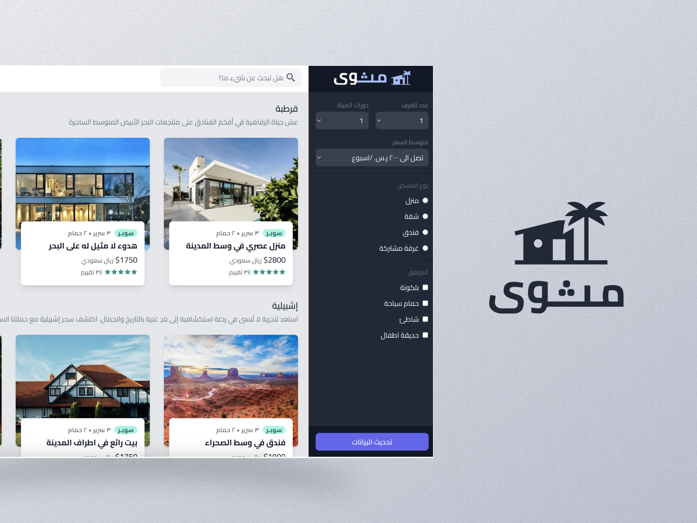

<div dir='rtl'> 
  <h1 align='center'>
    <a href='https://mathwa.netlify.app' target='_blank'>Mathwa | مثوى</a>
  </h1>
</div>
<center>

[inspiration](https://www.figma.com/file/SNUysoGLVJPm286sgXCEm2Ag/tailwind-course?node-id=0%3A1) &middot; [Live Preview](https://mathwa.netlify.app/)



</center>

## Overview

**Mathwa** is a project created with the primary goal of learining a Tailwind CSS tips and tricks, as well as general CSS best practices. Through this project, I explore various design concepts, including mobile-first design, and cater to different devices, such as mobile phones, iPads, laptops, and large screens.

### Key Objectives

- **Tailwind CSS Mastery:** Our primary objective is to master the web development using TailwindCSS effectively.

- **Responsive Design:** Mathwa emphasizes the importance of responsive design, ensuring that our dashboard looks and functions flawlessly on a wide range of devices, from small mobile screens to large desktop monitors.

### What I Learned

While I working on Mathwa, I'm gain valuable insights into:

- **Mobile-First Design:** Mathwa follows the mobile-first design philosophy, where we start by creating a responsive design for mobile devices and progressively enhance it for larger screens. You'll see firsthand how this approach simplifies the design process.

- **Tailwind CSS Tricks:** Mathwa is packed with examples of how to leverage Tailwind CSS effectively. Learn how to use utility classes, customize styles, and create beautiful and efficient user interfaces.

- **CSS Best Practices:** In addition to Tailwind-specific tips, I'm pick up general CSS best practices that will help me write clean, maintainable, and scalable styles for future projects.

### Dashboard for 4 Devices

Mathwa's dashboard is designed to accommodate four key device categories:

1. **Mobile:** Perfectly optimized for small screens, ensuring a seamless user experience on smartphones.

2. **iPad:** Tailored to the iPad's dimensions and touch interactions, offering a tablet-friendly experience.

3. **Laptop:** Optimized for laptop users, striking a balance between screen real estate and readability.

4. **Large Screens:** Designed to make the most of the available space on larger monitors, presenting a spacious and visually appealing dashboard.

## Installation

How to install and configure the project?

```bash
# Clone the repository
git clone https://github.com/kshawki/mathwa.git

# Change directory to your project folder
cd mathwa

# Install dependencies
npm install

# Start the development server
npm run dev
```

## Technology

- **Next.js:** We chose [Next.js](https://nextjs.org/) for its efficient server-side rendering and routing capabilities. It offers a fast and optimized user experience.

- **Figma:** Our design and prototyping tool of choice is [Figma](https://www.figma.com/), enabling us to create beautiful and interactive UI designs.

- **Tailwind CSS:** We leverage [Tailwind CSS](https://tailwindcss.com/) to craft elegant and responsive user interfaces with ease. Its utility-first approach streamlines the development process.

By using these technologies, Mathwa offers a robust, responsive, and visually appealing platform for learning and experimenting with Tailwind CSS and CSS best practices.
